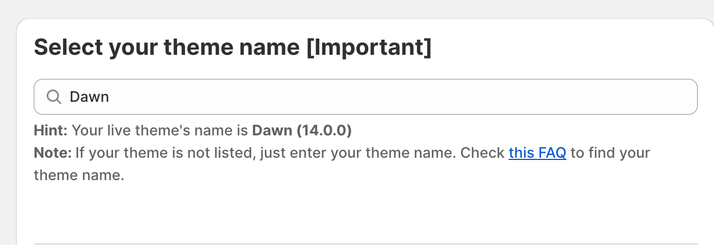

# 1️ Step 1: Setup basic configuration

#### Camouflage: Hide sold variants

This is the easiest way to hide/disable/strike-through variants (sold out or unavailable or any variant). All you need to do is follow a few simple steps:

1. [Install the app](https://apps.shopify.com/camouflage?utm_source=codecruxblogs)
2.  In the app dashboard, select/search your theme name \[Important]. If your theme is not listed, you can simply type your theme name. 

    <figure><figcaption></figcaption></figure>
3. Select the variant picker you use in your product pages (Dropdowns or Buttons/Swatches). This step helps Camouflage target variants on your product pages. If you're not sure about the variant picker, select "Detect Automatically".
   1.  Example of dropdown variant picker 

       <figure><figcaption></figcaption></figure>
   2.  Example of buttons/swatches 

       <figure><figcaption></figcaption></figure>
4. Set the action on. "Sold out variants"
   1. Set to "Hide" if you want to hide sold out variants
   2. Set to strike-through if you want to put a strike-through line on sold out items
   3. Set to to "strike-through + disabled" if you want to put a strike-through line on sold out items as well as make them non-clickable.
   4. Set to "None" if you don't want Camouflage to do anything to the sold out variants.
5. Set the action on "Unavailable variants"
   1.  **Info on what are unavailable variants:**  When a variant exists in the Shopify admin but there is no inventory to sell, the variant is called **"Sold out"**. However, if the variant doesn't exist in the Shopify admin, it is called **"Unavailable variant"**. It happens only when the product has 2 or more options. Eg: **Size** and **Color** options. 

       **Example:** If you have a Red/XL variant, it might be in-stock or out-of-stock. But if Red/XXL variant doesn't exist but the product has XXL size in other colors, Red/XXL will be called Unavailable variant.
   2. Tick the checkbox if you want to hide unavailable variants.
6.  **Third party app integrations:** If you're using a third party app for the variant picker, select the app name from the "Third party app integrations" dropdown. If the app isn't listed there, you can contact our support theme.

7. Click **"Save"** button to save the progress.

