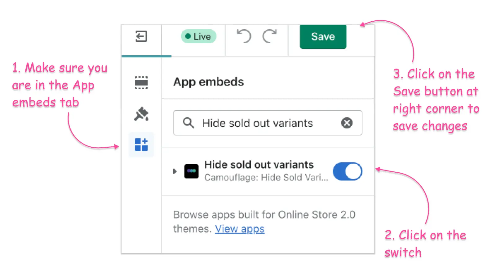

# FAQs

How to find the theme name?

You can find the theme name below the last saved information. Refer to the following screenshot:

 

How to enable the app?


Navigate to Shopify admin -> Themes -> Click on Customise button -> Click on App embeds Icon at the left sidebar -> Click on the switch button next to **Camouflage sold variants** and Save


<figure><figcaption></figcaption></figure>

<figure><figcaption></figcaption></figure>



