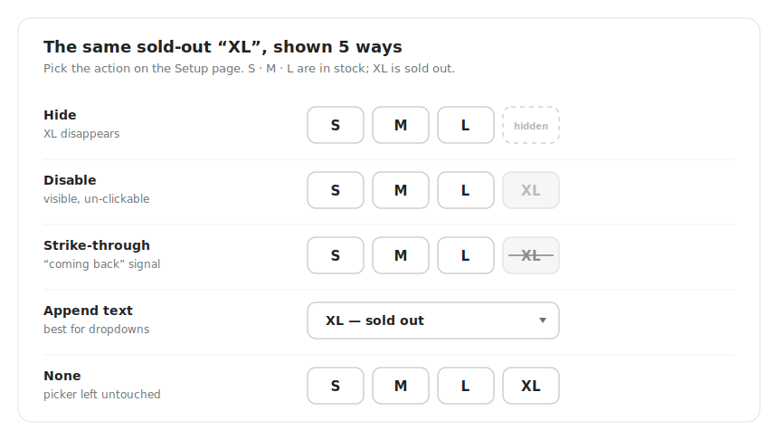

# 🎬 Choosing what happens to sold-out variants

When Camouflage finds a sold-out or unavailable variant, it applies the **action** you picked on the Setup page (Step 1). Each action creates a different shopping experience - here's how to choose.

<figure><figcaption>One sold-out size, shown five ways - the action you pick on the Setup page decides which.</figcaption></figure>

## The actions

<table><thead><tr><th width="160">Action</th><th>What the shopper sees</th><th>Best when…</th></tr></thead><tbody><tr><td><strong>Hide</strong></td><td>The sold-out option disappears from the picker entirely.</td><td>You restock rarely or never (one-off drops, discontinued sizes), and showing dead options only creates disappointment.</td></tr><tr><td><strong>Disable</strong></td><td>The option stays visible but can't be selected.</td><td>You want shoppers to see the full range while making dead ends unclickable.</td></tr><tr><td><strong>Strike-through</strong></td><td>The option shows with a line through it and can't be selected.</td><td>You restock regularly - shoppers see the size/color exists and may come back for it. The classic "sold out but returning" signal.</td></tr><tr><td><strong>Append text</strong></td><td>Dropdown options get a suffix like "<em>- sold out</em>" and can't be picked.</td><td>Your picker uses dropdowns and you want an explicit label instead of styling.</td></tr><tr><td><strong>None</strong></td><td>The picker is left untouched.</td><td>You only use Camouflage's other features (collection filtering, checkout validation) and want the picker as-is.</td></tr></tbody></table>

## Tips for choosing

* **Hide vs strike-through is really a restocking question.** If the variant is coming back, keep it visible (strike-through / disable / append text) so shoppers know to return. If it isn't, hide it.
* **You can treat "sold out" and "unavailable" differently.** Many stores strike through sold-out variants but fully hide [unavailable combinations](../popular-use-cases/hide-unavailable-variants-but-not-sold-out-variants.md) that never existed.
* **Dropdown pickers + strike-through:** some browsers limit how much styling a dropdown option can carry - if the line doesn't show, see [Troubleshooting](../troubleshooting.md) or switch to **Append text**, which is built for dropdowns.
* Whatever action you pick, shoppers can never *buy* a variant Camouflage manages once you also enable [checkout validation](../popular-use-cases/block-hidden-variants-at-checkout.md).

You can change the action at any time from the Setup page - it applies storewide within a few minutes. Want a mixed setup (e.g. hide one option axis, strike through another)? Open the in-app chat and we'll configure it for you.
