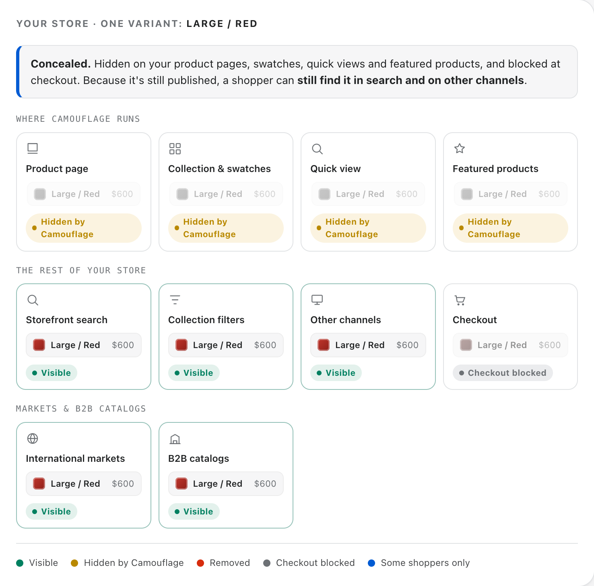
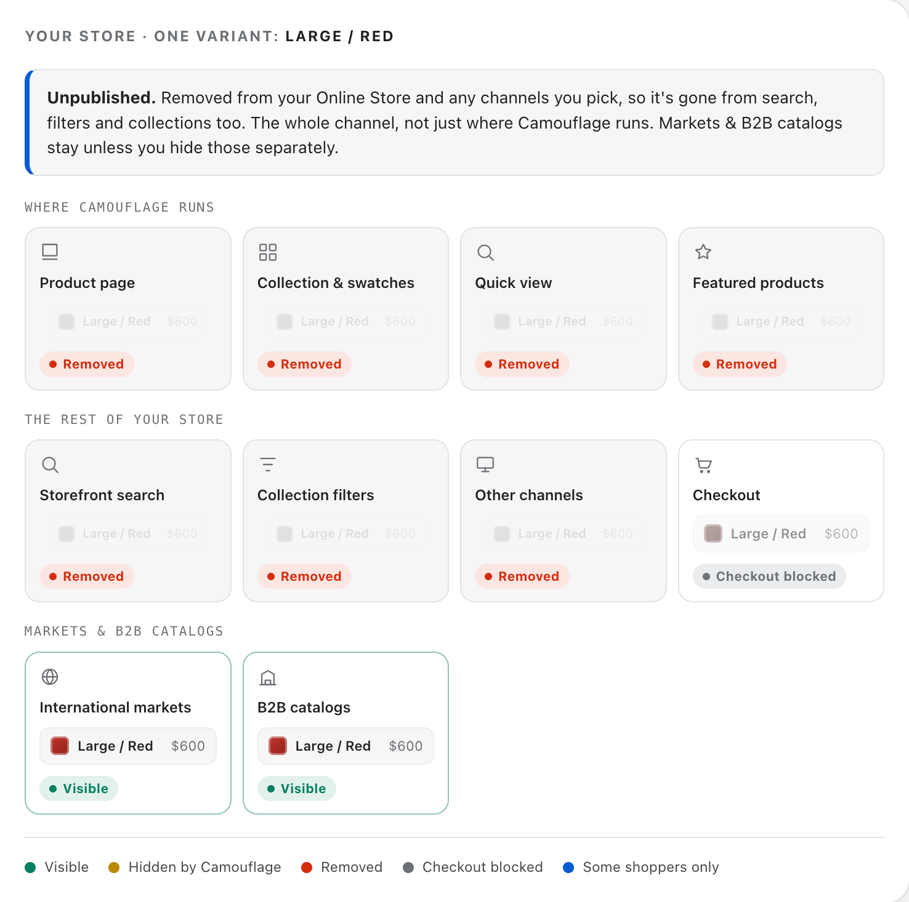
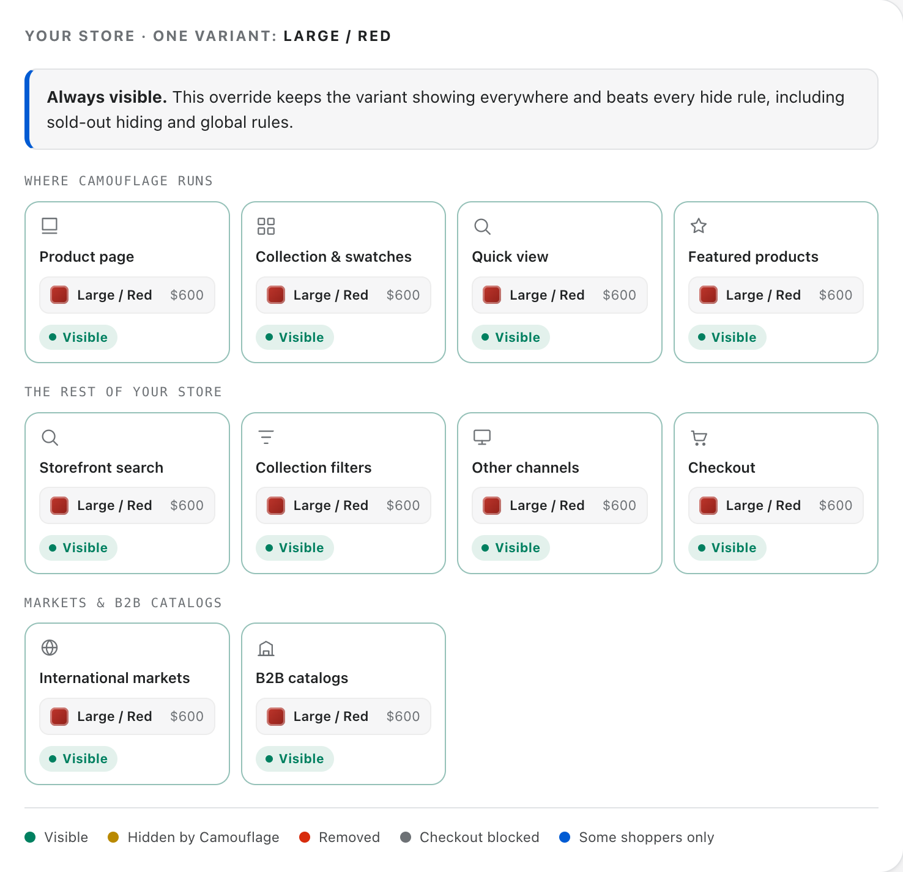
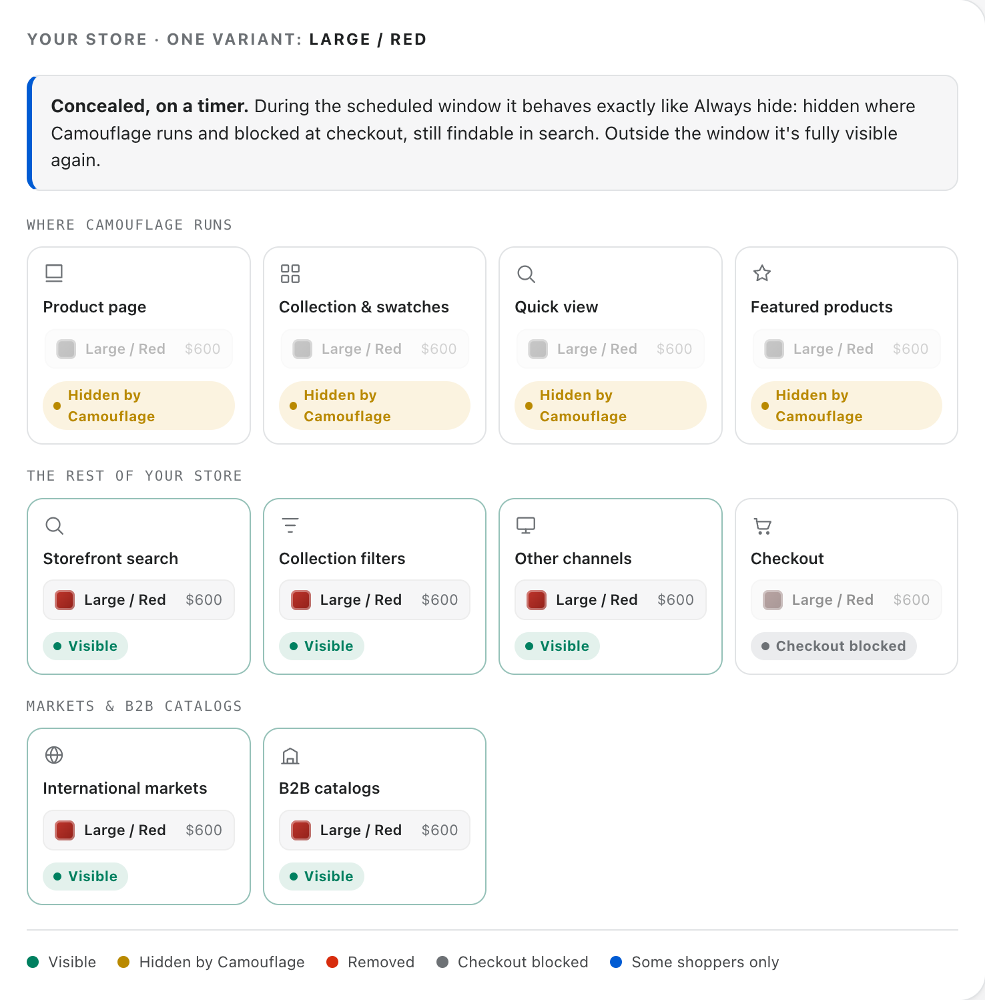
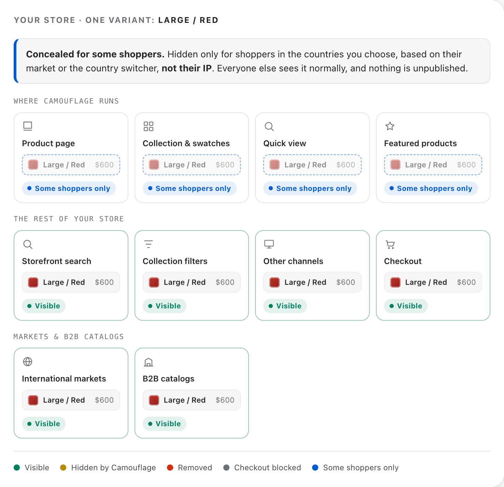
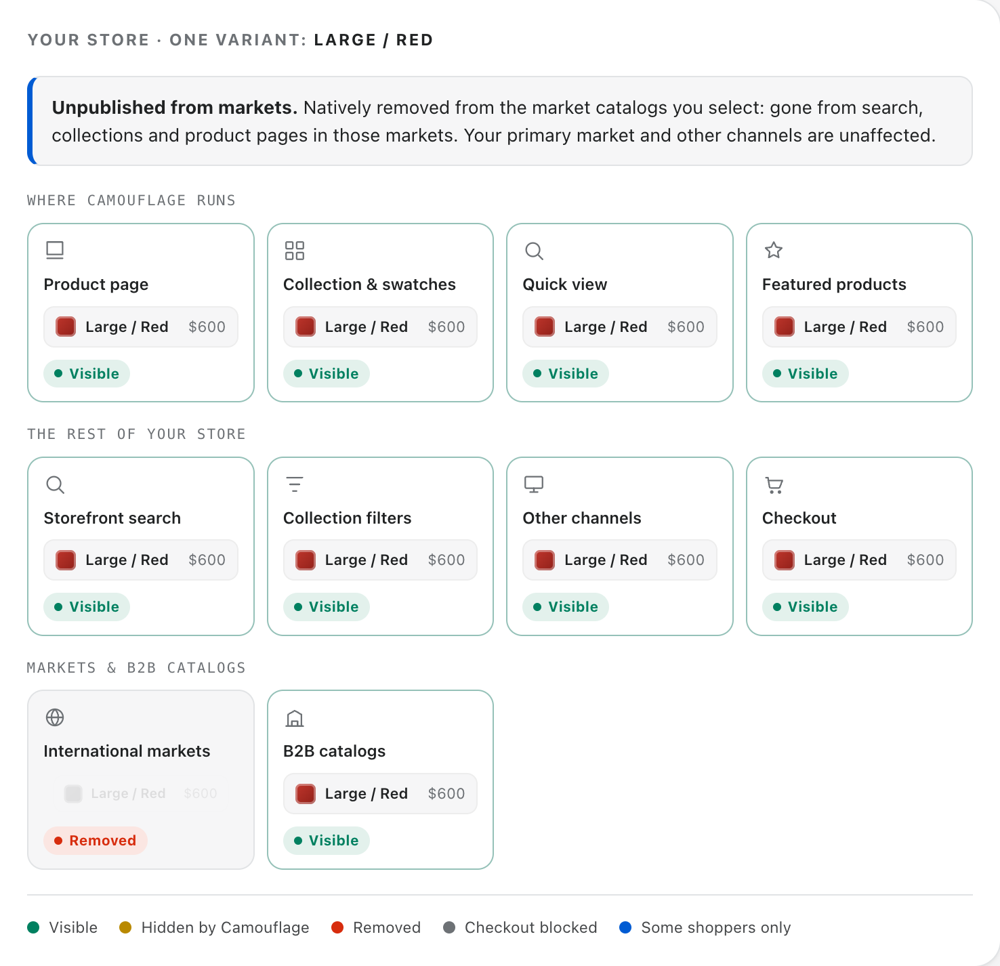
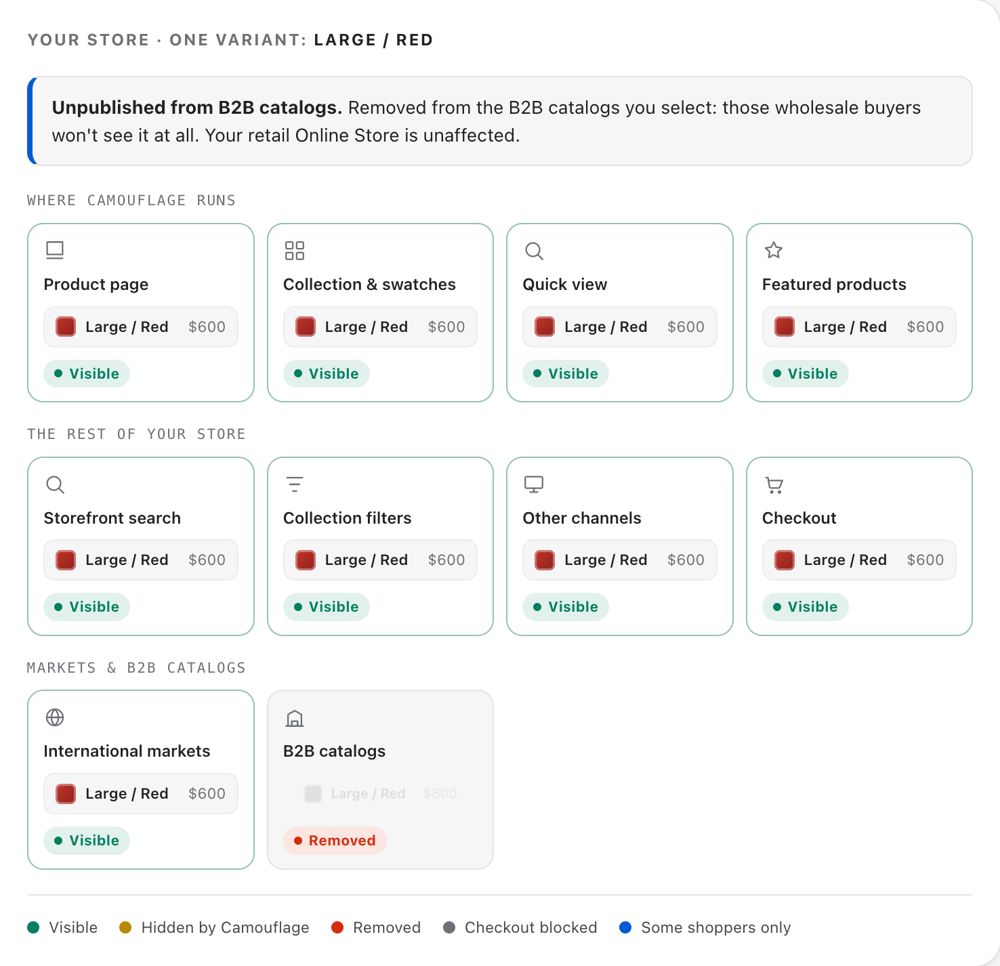

# ✨ Our Features

#### With Camouflage, you can: 

* Hide, disable, strike-through or un-publish sold-out variants.
* Schedule Hide variants based on Date and Time
* Hide specific variants regardless of inventory, giving you complete control without deleting them.
* Hide variants based on the inventory quantity or set inventory threshold for specific product and it's variants.
* Hide the images of Hidden Variants
* Set conditions to hide variants based on countries, customer tags, and more which makes it perfect for both quick views and collection pages.
* Helps you hide variants in Quick Views, Home Page, Collection Pages, and Custom Pages.
* Unpublish variants from different sales channels.
* Hide variants from specific Shopify Markets or B2B catalogs, without affecting the rest of your store.
* Works with Customised themes and third party app integrations like Swatch King, Pagefly, Globo Swatch etc. 

### See what each hiding option does

Camouflage can hide a variant in two different ways: **conceal** it on your storefront (where your customers browse), or **unpublish** it from a sales channel, market or catalog. Knowing which one you're using tells you exactly where the variant disappears from, and where it stays visible.

Open each tab below to see what happens to a single variant (`Large / Red`) across your store:



**Concealed on your storefront.** Hidden wherever Camouflage runs, product pages, collection swatches, quick views and featured products, and blocked at checkout. It stays published, so it can still appear in search and on other channels.

<figure></figure>



**Removed from the channel.** With native publishing turned on, the variant is also unpublished from the sales channels you pick, so it disappears from search, filters and collections too, the whole channel, not just where Camouflage runs. Markets and B2B catalogs stay unless you hide those separately.

<figure></figure>



**Always visible.** Forces the variant to show everywhere and overrides every hide rule, including sold-out hiding.

<figure></figure>



**Hidden on a timer.** Behaves exactly like Always hide, but only between the start and end times you set. Turn on native publishing to also unpublish the variant for the duration of the window, then it is republished automatically when the window ends.

<figure></figure>



**Hidden for some shoppers.** Hidden only for shoppers in the countries you choose, based on their market or your store's country switcher, not their physical location. Everyone else sees the variant normally, and nothing is unpublished.

<figure></figure>



**Removed from selected markets.** Unpublished from the market catalogs you choose, so the variant disappears from search, collections and product pages in those markets. Your primary market and other channels are unaffected.

<figure></figure>



**Removed from selected B2B catalogs.** Unpublished from the B2B catalogs you choose, so those wholesale buyers no longer see it. Your retail Online Store is unaffected.

<figure></figure>



**Want to try it yourself?** Open the interactive version and click through every option:


Interactive guide: what happens to a variant for each hiding option


### Disable or strike-through sold out options


Strike-through




### Append a text to the sold out options



### Hide sold out options





Not only the product pages, Camouflage can also hide variant options, color swatches etc from Home page, Collection pages, Quick views etc.
