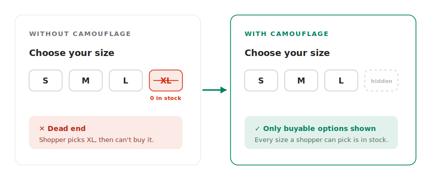

# 💡 What we do

## Video overview

Got 2 minutes? Check out a video overview of our product:


Camouflage


**"We Know the Feeling"**

The frustration of clicking on a product only to find the variant is sold out? Customers hate it, and it can hurt your Shopify store's user experience.

<figure><figcaption>Camouflage removes the dead-end options, so every choice a shopper can make is one they can buy.</figcaption></figure>

Camouflage gives you complete control over your Shopify variants like hide, disable, or strike-through variants based on stock, inventory levels, customer location, tags, and custom conditions. You can seamlessly manage variant visibility across product pages, quick views, collections pages, home page and custom themes while staying compatible with popular third-party apps. This cleans up your product pages, and enhances the buying experience.

No more wasted clicks. No more frustration. Just a smoother, more efficient shopping journey for everyone. \
\
Camouflage is easy to integrate with a wide range of custom themes and popular apps, giving you seamless control over your store's display.

## How it works (in plain English)

You don't have to touch any code to use Camouflage. Here's the path from install to your store looking cleaner:

1. **Install** - Add Camouflage to your store from the Shopify App Store.
2. **Choose your theme** - Pick your theme name from the dropdown on the Setup page. This tells Camouflage what your variant picker looks like.
3. **Decide what should happen to sold-out variants** - Hide them, show them with a strike-through, or just disable them. You choose.
4. **Activate Camouflage in your theme** - One click from the Setup page turns on the Camouflage app embed in your live theme.
5. **Done** - Reload your product pages and the sold-out / unavailable variants will disappear (or be greyed out, depending on what you chose).


Want to try it without affecting your live store first? Camouflage works in **draft themes** too - see [Testing in a draft theme](../camouflage-setup-guide/testing-in-a-draft-theme.md).


## Where Camouflage works in your store

* **Product pages** - the variant picker (the Size / Color / Material dropdowns or buttons)
* **Collection pages** - sold-out colour swatches on product cards
* **Quick views** - the popup variant picker some themes show on the collection page
* **Featured products** - variant pickers shown on the home page, landing pages, or any custom section
* **Checkout** - a final safety net so a sold-out / restricted variant can't be ordered even by direct link

## Next steps

* Brand new? Start with the [Setup Guide](../camouflage-setup-guide/basic-configuration.md).
* Curious about everything Camouflage can do? Browse [Our Features](our-features.md) or [Popular Use Cases](../popular-use-cases/hide-specific-variants-regardless-of-inventory-quantity.md).
* Hit a snag? Read [Troubleshooting](../troubleshooting.md) or [FAQs](../faqs.md).
