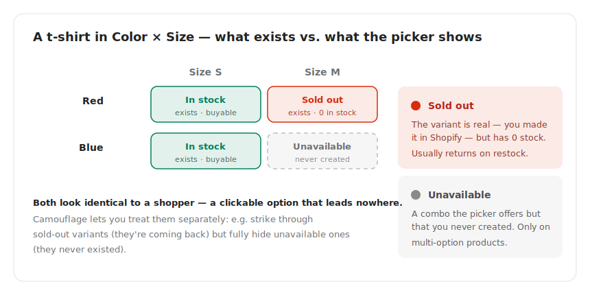

# Hide Unavailable variants but not sold-out variants

## What's the difference between "sold out" and "unavailable"?

This trips a lot of merchants up - they sound the same, but Shopify treats them differently:

* **Sold out** - The variant **exists in your admin** (you set it up with a price, SKU, inventory tracking, etc.) but it's currently at zero stock. Once you restock, it's back.
* **Unavailable** - The variant **doesn't exist in your admin**. The shopper sees the option only because some *other* size or colour fills out the combination grid.

Unavailable variants only happen when a product has **two or more option axes** (e.g. Size *and* Color).

<figure><figcaption>Sold-out variants exist in your admin at zero stock; unavailable ones were never created. Camouflage can treat them separately.</figcaption></figure>

### Example

You sell t-shirts with the following set up in admin:

| Color × Size | S | M | L | XL |
| ------------ | - | - | - | -- |
| Red          | ✅ | ✅ | ✅ | ✅ |
| Blue         | ✅ | ✅ | ✅ | ❌ |

* Red / XL might be **in stock** or **sold out** depending on inventory. Either way, it exists - you set it up.
* Blue / XL is **unavailable** - you never created it. Customers shouldn't be able to click it at all.

## When to use this setting

* You **want** to keep showing sold-out variants (e.g. as a strike-through, or to encourage "notify me when back" flows).
* You **don't want** to show combinations that were never created in the first place - they only confuse the shopper.

## How to enable it

1. Open the Camouflage app from your Shopify admin.
2. Go to the **Setup** page (refer to [Step 1](../camouflage-setup-guide/basic-configuration.md) if you haven't completed the basic setup yet).
3. Set **"Action on sold-out variants"** to **None** (so sold-out variants stay visible).
4. Tick the **"Hide Unavailable Variants"** checkbox.
5. Click **Save**.

That's it. Reload any product page and unavailable combinations will be gone, while sold-out ones remain visible.


You can combine "Hide Unavailable Variants" with **any** action for sold-out variants - hide, strike-through, disabled, or none. It's an independent setting.


## Related

* Want to also hide sold-out variants? See [Step 1: Setup basic configuration](../camouflage-setup-guide/basic-configuration.md) and pick "Hide" as the sold-out action.
* Hiding specific variants regardless of stock? See [Hide specific variants regardless of inventory quantity](hide-specific-variants-regardless-of-inventory-quantity.md).
