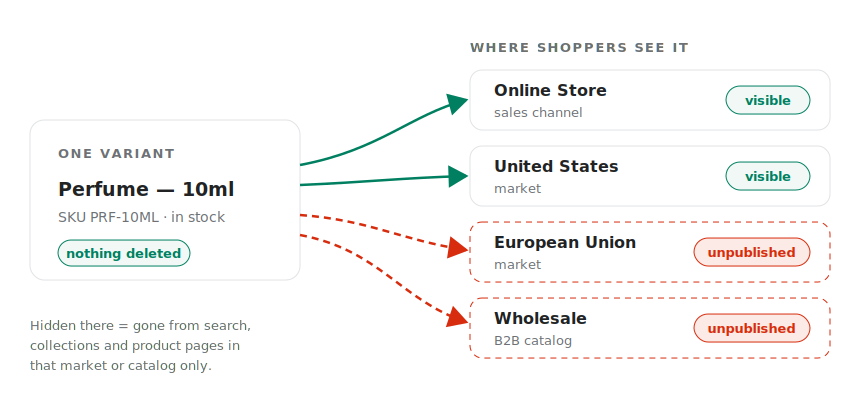

# 🌍 Hide variants from specific markets or B2B catalogs

Selling worldwide rarely means selling *everything* everywhere. A size that is not certified in one region, a formula you cannot ship abroad, an exclusive colourway reserved for one country - sometimes a variant simply must not be offered in a particular market, even though it is in stock and selling fine everywhere else.

With Camouflage you can pick exactly which variants are **unpublished** from a Shopify **Market** or a **B2B catalog**. In that market or catalog the variant is simply not for sale: it vanishes from storefront search, collection filters and product pages there. Every other market, your online store and your other sales channels are not affected.

Real-world scenarios:

* **Regulations.** Your 10ml aerosol size cannot be sold in the EU - hide it from your European Union market while the US keeps selling it.
* **Shipping restrictions.** Glass bottles survive domestic shipping but not international - hide them from your international markets.
* **Regional exclusives.** The "Tokyo Edition" colourway is exclusive to your Japan market - hide it everywhere else.
* **Wholesale assortment.** Your B2B customers order by the case, so single-unit variants should not appear in their catalog - hide them from the B2B catalog only.

<figure><figcaption>One variant, different availability per market or B2B catalog - nothing is deleted.</figcaption></figure>


**How is this different from [hiding by countries](hide-specific-variants-based-on-countries.md)?** Country-based hiding works on your storefront pages, based on where the shopper is browsing from. Market/B2B hiding goes deeper: Camouflage **unpublishes** the variant from that market's catalog in Shopify itself, so it also disappears from search results and collection filters there - the same way [Native Publishing](remove-hidden-variants-from-search-and-collections.md) works for sales channels.


## Before you start

1. Make sure the theme setup is done. Refer to [Step 1](../camouflage-setup-guide/basic-configuration.md).
2. Turn on **Native publishing** - this feature runs on it. See [Remove hidden variants from search & collections](remove-hidden-variants-from-search-and-collections.md). Hiding from **Markets and B2B catalogs** is available on the **Pro plan and above**. ([Compare plans](https://camouflage.codecrux.dev/upgrade).)
3. Set up what you want to hide from in Shopify admin:
   * **Markets**: your store needs at least one market configured (Shopify admin -> Settings -> Markets).
   * **B2B catalogs**: create one under Customers -> Companies in Shopify admin.
   * In both cases the market/catalog must have **publishing controls** turned on (i.e. you curate its products in Shopify admin). If a catalog shows as "no publishing controls" in the picker, open it in Shopify admin and choose to manage its products first.
4. The first time you use this, Camouflage may ask for extra read permissions so it can list your markets and B2B catalogs - click **Update permissions** and come back.

There are two ways to use it: pick variants one by one, or write a rule that applies across your whole catalog.

## Option 1: Hide selected variants of a product

1. Go to the Camouflage app -> `Hide specific variants` page -> `Select variants individually` tab.
2. Search for the product and click **Manage variants**.
3. Tick the variants you want to hide (or use **Find variants by option** to select them in bulk, e.g. every variant where Size = 10ml).
4. Click **Hide from markets** (or **Hide from B2B**). The button only appears when your store actually has markets (or B2B catalogs) with publishing controls on.
5. In the dialog, pick the markets or B2B catalogs to hide from, then click **Apply to N variants**.

That's it. The variants are unpublished from the chosen markets or catalogs within a few moments. To undo, select the variants again and choose **Undo actions** -> **Undo hide from markets** (or **Undo hide from B2B catalogs**) - Camouflage publishes them right back.

## Option 2: Hide matching variants across all products with a rule

Perfect when the same variants exist on many products (every "10ml" size, every SKU ending in `-EU-X`).

1. Go to the Camouflage app -> `Hide specific variants` page -> `Apply to variants across all products` tab.
2. Click **Add rule** and choose **Market rule** (or **B2B catalog rule**).
3. Pick the markets or B2B catalogs to hide from.
4. Optionally narrow **Match variants by** to an option (e.g. Size), variant title or SKU, and enter the **Values to hide**. With no matcher, every variant of the matching products is unpublished there - use the product type/tag conditions to narrow which products.
5. Check the **Rule preview** sentence says what you expect, then click **Save rule**.

The rule is applied across your catalog during the regular sync passes, and to new products as they qualify. Deleting the rule publishes the affected variants back.


If a market or catalog you targeted is later deleted, archived, or has its publishing controls turned off, the rule shows a **Needs attention** badge - edit the rule and re-pick the targets. Variants Camouflage already hid stay hidden until you fix or delete the rule.


## Worked example: keep the 10ml size out of the EU

Say you sell perfume in 5ml, 10ml and 50ml, and the 10ml spray cannot be sold in the EU:

1. Open the `Apply to variants across all products` tab and click **Add rule** -> **Market rule**.
2. Under **Hide from these markets**, pick **European Union**.
3. Set **Match variants by** to your **Size** option and enter `10ml` under **Values to hide**.
4. The preview reads "Unpublish variants with Size 10ml from the selected markets". Click **Save rule**.

EU shoppers no longer see the 10ml size anywhere - not on product pages, not in search, not in collection filters. Shoppers in every other market still buy it as usual. When the regulation changes, delete the rule and the 10ml variants are published back to the EU automatically.

## Variations / common patterns

### Hiding from B2B customers by tag instead

If your wholesale setup uses **customer tags** rather than Shopify's B2B catalogs, use the tag-based approach instead:


[hide-variants-from-b2b-or-wholesale-customers.md](hide-variants-from-b2b-or-wholesale-customers.md)


### Hiding based on the shopper's country (without unpublishing)

For page-level hiding driven by the visitor's location - useful when you have not set up separate markets:


[hide-specific-variants-based-on-countries.md](hide-specific-variants-based-on-countries.md)


### Applying changes right away

Rule-based hides are applied during the regular sync passes. Just made a big change and don't want to wait? Click **Sync now** next to the **Native publishing** checkbox - Camouflage re-checks every variant and updates everything right away.

## Still stuck?

Open the in-app chat from your Camouflage dashboard, or email [raj@codecrux.dev](mailto:raj@codecrux.dev) and our team will set it up for you.
